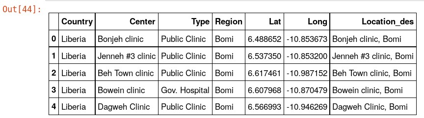
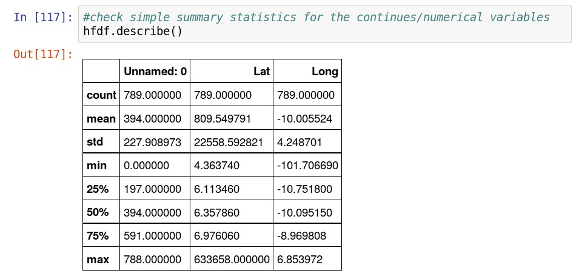
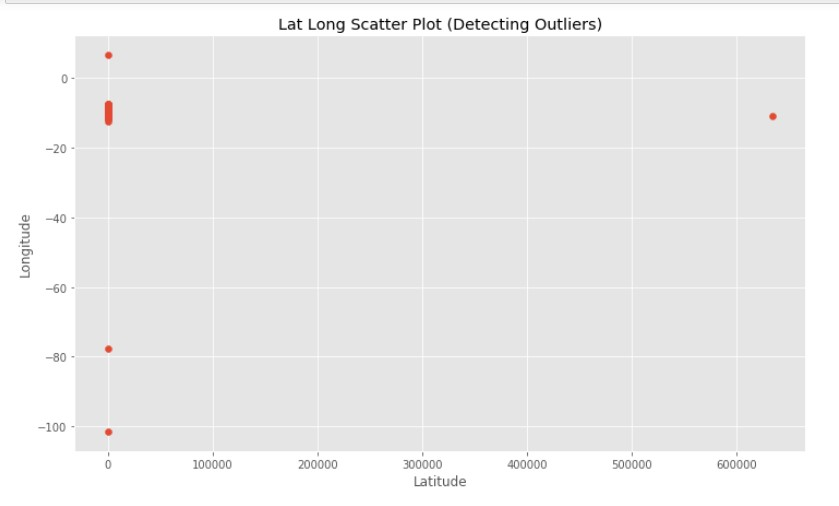
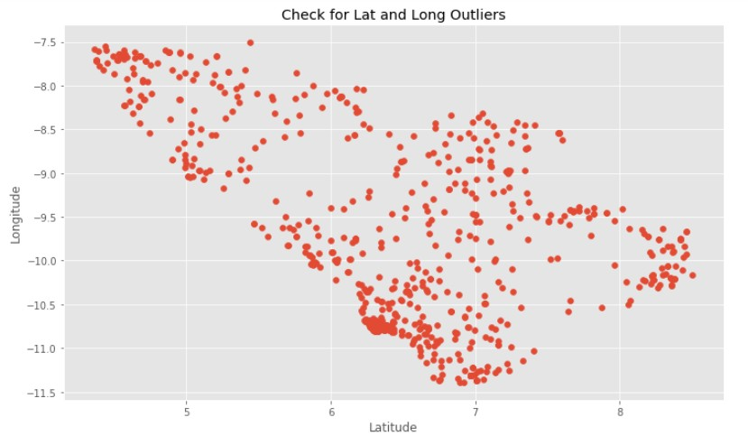
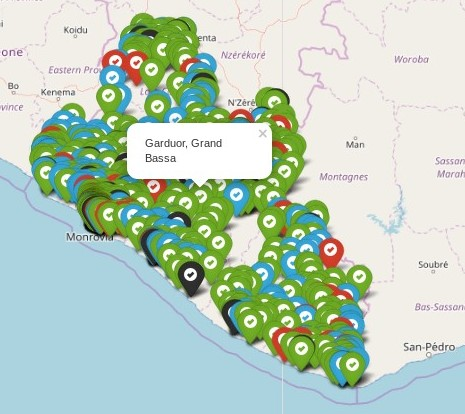

## Liberia Health Facilities Locations

<div>
  <p>In this Visualization Project. I will be using folium leaflet Map to visually depict the location of all health Facilities in Liberia
  </p>
  <p><h3>Objectives:</h3>
  To GEOGRAPICALLY visualize on an interactive leaflet Map the location of all the health facilities in Liberia. and also create summary charts. This can be useful for report preparation with regards to the health centers in Liberia and will help us in decision making. This project also show us which county in Liberia have the highest number of health facilities. Which Type of Health center (Hospital, clinic, etc) and how many of them you can find in each county.
  </p>
</div>

### IMPORTATION OF PYTHON REQUIRED LIBRARIES FOR THE PROJECT
There are numerous Python Libraries used for Data Analysis. This imported libraries will be use for data Reading, manipulation, cleaning/wangling visualization and other exploratory data Analysis.
```python
#import the libraries
import pandas as pd
import matplotlib.pyplot as plt
import numpy as np
import folium
%matplotlib inline
```

### Reading the Data into a Pandas Data Frame
<hr>
The Below code will read in the data into a Data frame(2-Dimentional data Panel) from a .CSV (Command Separated Values) File. The pandas Library will be use for the reading. Also the .head() method of the pandas library will be used to view the first 5 rows from the data to give us a clue of how the data is structured.
```python
#read in the data from a csv file using pandas library
hfdf=pd.read_csv("healthFacilitiesClean.csv")
hfdf.head()
```


### Health Facilities Type Count Summary
<hr>
My interest is to visualized the Health Centers location and Determine the type of Health Facilities in Liberia. The code below will count the type of health facilities in Liberia.

```python
#count the type of unique health facilities
#we have in the dataframe
hfdf['Type'].value_counts()
```


From the Health Facilities Type Count Summary. you can see that we have 500 Clinics, 45 Health Centers and so on.
### Wrong and Missing Values in the Dataset
But there is a problem with the entries in the dataset. there are some clinics with the spelling: "Clinic?", "Clinic (HC)" and so on. Making them to be counted as different type of Health Facilities. Also from the top 5 rows from the dataset view viewed above. We can see that there are some missing values in the dataset represented as **NAN**

To take care of correcting those values. the follow code will clean the data for Analysis. deleting/dropping the unwanted columns and replace the missed spelled entries values with the correct entries. and Fill-in the **NAN** values with the necessary values.

```python
#replace all "1 Gov. Hospital" with "Gov. Hospital"
hfdf.Type.replace("1 Gov. Hospital","Gov. Hospital",inplace=True)
#replace "1 Public Clinic" with "Public Clinic"
hfdf.Type.replace("1 Public Clinic","Public Clinic",inplace=True)
#replace "Hosp" With "Hospital"
hfdf.Type.replace("Hosp","Hospital",inplace=True)
#replace "GP? TBC" with "TBC"
hfdf.Type.replace("GP? TBC","TBC",inplace=True)
#replace "GP? -TBC" with "TBC"
hfdf.Type.replace("TGP? - TBC","TBC",inplace=True)
hfdf.Type.replace("Clinic?","Clinic",inplace=True)
hfdf.Type.replace("ETC?","ETC",inplace=True)
hfdf.Type.replace("Dentist? TBC","TBC",inplace=True)
hfdf.Type.replace("8 beds","Clinic",inplace=True)
hfdf.Type.replace("Clinic (?)","Clinic",inplace=True)
hfdf.Type.replace("Cinic","Clinic",inplace=True)
hfdf.Type.replace("GP? - TBC","TBC",inplace=True)
hfdf.Type.replace("Clinic (HC)","Clinic",inplace=True)
hfdf.Type.replace("ETU","ETC",inplace=True)
hfdf.Type.replace("HC","Health Center",inplace=True)
#Count unique Entries again
hfdf.Type.value_counts()
```


After the cleaning: we name have unique count of each type of health Facility. Hence there are 506 clinics, 49 health Centers and so on.

<h5>Filling Missing Values </h5>
The Pandas Method Below will remove all missing Values (NAN) from the dataset. I am implementing the forward fill method
```python
#fill in the NAN values with using pandas fillna function with the forward fill parameter
hfdf.fillna(method='ffill')
hfdf.head()
```


### Basic Summary Statistics
Now that we have the dataset Cleaned and ready for the visualization, Let take some basic Statistics on the dataset using the pandas describe() method.


The above result show the summary for the categorical variables we have in the dataset. We can see that for the:
1. ***country*** variable, have 789 records and 1 unique entry since Liberia is the only country under consideration. Hence the top Entry is Liberia.
2. For the ***Center*** Variable, we have 783 entries. with 776 Unique entries. **Juduken** have the highest centers entries with 2 frequencies.
3. For the ***Region*** variable. **Montserrado** county have the highest number of entries. with 202 frequencies.


The result above show the summary statistics for the numerical variables. from the statistics we can see that there are outliers for the ***Lat*** Entry. The ***Max*** value of *633658.000000* is far above all other entries.

```python
plt.figure(figsize=(12,7))
plt.scatter(hfdf.Lat,hfdf.Long)
plt.xlabel("Latitude")
plt.ylabel("Longitude")
plt.title("Lat Long Scatter Plot (Detecting Outliers)")
plt.show()
```

From the Lat, Long Scatter plot above. We see that there are 4 outliers.

Hence, further data cleaning is carry on to produce the below lat, long scatter plot without the outliers. Some of the outlier data points are dropped and some corrected. Like the lat ***633658.000000 was corrected by replacing it with 6.33658***


### Plotting the data on a Folium Leaflet Map
```python
#find the lat, long mean/average to centers
# the map at the mean point.
liblat=hfdf['Lat'].mean()
liblong=hfdf["Long"].mean()
#get the latituts from the dataframe
lats=list(hfdf['Lat'])
#get the longitudes from the dataframe
longs=list(hfdf['Long'])
#get the healths centers names and Locations
hcdescriptions=list(hfdf["Location_des"])
#get the type of health center list
htype=list(hfdf['Type'])
#print the mean Lat and long values
print(liblat,liblong)

RESULT:
   (6.441912960391857, -9.822748073872773)
```
```python
#plot the folium map with the points
hcmap=folium.Map(location=[liblat, liblong],zoom_start=7)

#create a future group
hCenters=folium.FeatureGroup()

#plot the health facilities on the map using a loop
for hlat,hlong,hname,ht in zip(lats,longs,hcdescriptions,htype):
    pname=folium.Popup(html=hname,parse_html=True)
    #differential the health center markers colors by types
    if ht=="Clinic":
        folium.Marker(
        location=[hlat, hlong],
        popup=pname,
        icon=folium.Icon(color='green', icon='ok-sign'),
    ).add_to(hCenters)
    elif ht=="Health Center":
        folium.Marker(
        location=[hlat, hlong],
        popup=pname,
        icon=folium.Icon(color='red', icon='ok-sign'),
    ).add_to(hCenters)
    elif ht=="Hospital":
        folium.Marker(
        location=[hlat, hlong],
        popup=pname,
        icon=folium.Icon(color='black', icon='ok-sign'),
    ).add_to(hCenters)
    else:
        folium.Marker(
        location=[hlat, hlong],
        popup=pname,
        icon=folium.Icon(color='blue', icon='ok-sign'),
    ).add_to(hCenters)

hcmap.add_child(hCenters)
hcmap.save("secondSaveMap.html")
hcmap
```
After Running the above code the below map is created. you can see they Health Facilities each plotted at it location.



* you can Click on each marker to see the Facility name and Location (County/Region)
* You can also click on the + or - Button at the top left corner of the map to zoom in and zoom out respectively.
* you can also zoom in by double clicking and you can navigate to other locations clicking and dragging the side you want to see.

<a href="../secondSaveMap.html" target="_blank">Click on the map or here to view the live interactive map.</a>


<div>
<a href="../clustermap.html" target="_blank" >Click to view live map</a>
</div>
