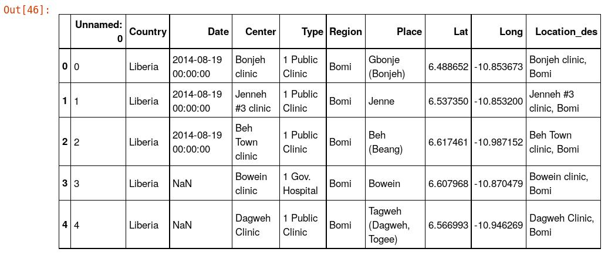
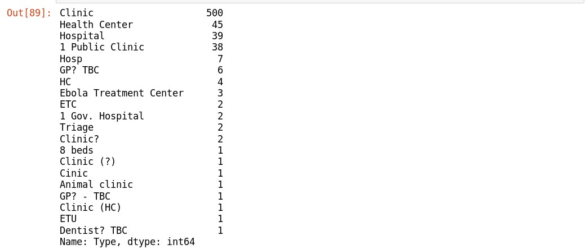
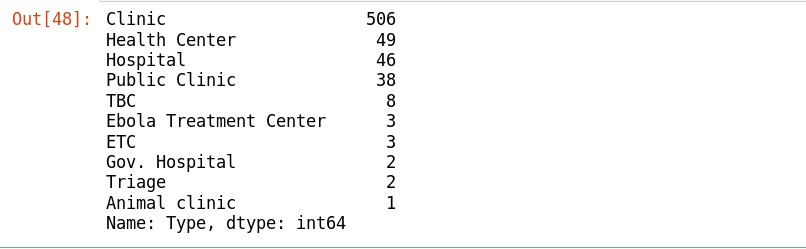

## Liberia Health Facilities Locations

<div>
  <p>In this Visualization Project. I will be using folium leaflet Map to visually depict the location of all health Facilities Liberia
  </p>
  <p><h3>Objectives:</h3>
  To Visually Show on an interactive leaflet Map the location of all the health facilities in Liberia. and also create summary charts. This can be useful for report preparation with regards to the health centers in Liberia and will help us in decision making. This project also show us which county in Liberia have the highest number of health facilities. Which Type of Health center (Hospital, clinic, etc) and how many of them you can find in each county.
  </p>
</div>

### IMPORTATION OF PYTHON REQUIRED LIBRARIES FOR THE PROJECT
There are numerous Python Libraries used for Data Analysis. This imported libraries will be use for data Reading, manipulation, cleaning/wangling visualization and other exploratory data Analysis.
```python
#import the libraries
import pandas as pd
import matplotlib.pyplot as plt
import numpy as np
import folium
%matplotlib inline
```

### Reading the Data into a Pandas Data Frame
<hr>
The Below code will read in the data into a Data frame(2-Dimentional data Panel) from a .CSV (Command Separated Values) File. The pandas Library will be use for the reading. Also the .head() method of the pandas library will be used to view the first 5 rows from the data to give us a clue of how the data is structured.
```python
#read in the data from a csv file using pandas library
hfdf=pd.read_csv("healthFacilitiesClean.csv")
hfdf.head()
```



### Health Facilities Type Count Summary
<hr>
My interest is to visualized the Health Centers location and Determine the type of Health Facilities in Liberia. The code below will count the type of health facilities in Liberia.

```python
#count the type of unique health facilities
#we have in the dataframe
hfdf['Type'].value_counts()
```


From the Health Facilities Type Count Summary. you can see that we have 500 Clinics, 45 Health Centers and so on.
### Wrong and Missing Values in the Dataset
But there is a problem with the entries in the dataset. there are some clinics with the spelling: "Clinic?", "Clinic (HC)" and so on. Making them to be counted as different type of Health Facilities. Also from the top 5 rows from the dataset view viewed above. We can see that there are some missing values in the dataset represented as **NAN**

To take care of correcting those values. the follow code will clean the data for Analysis. deleting/dropping the unwanted columns and replace the missed spelled entries values with the correct entries. and Fill-in the **NAN** values with the necessary values.

```python
#replace all "1 Gov. Hospital" with "Gov. Hospital"
hfdf.Type.replace("1 Gov. Hospital","Gov. Hospital",inplace=True)
#replace "1 Public Clinic" with "Public Clinic"
hfdf.Type.replace("1 Public Clinic","Public Clinic",inplace=True)
#replace "Hosp" With "Hospital"
hfdf.Type.replace("Hosp","Hospital",inplace=True)
#replace "GP? TBC" with "TBC"
hfdf.Type.replace("GP? TBC","TBC",inplace=True)
#replace "GP? -TBC" with "TBC"
hfdf.Type.replace("TGP? - TBC","TBC",inplace=True)
hfdf.Type.replace("Clinic?","Clinic",inplace=True)
hfdf.Type.replace("ETC?","ETC",inplace=True)
hfdf.Type.replace("Dentist? TBC","TBC",inplace=True)
hfdf.Type.replace("8 beds","Clinic",inplace=True)
hfdf.Type.replace("Clinic (?)","Clinic",inplace=True)
hfdf.Type.replace("Cinic","Clinic",inplace=True)
hfdf.Type.replace("GP? - TBC","TBC",inplace=True)
hfdf.Type.replace("Clinic (HC)","Clinic",inplace=True)
hfdf.Type.replace("ETU","ETC",inplace=True)
hfdf.Type.replace("HC","Health Center",inplace=True)
#Count unique Entries again
hfdf.Type.value_counts()
```


<div>
<a href="../clustermap.html" target="_blank" >Click to view live map</a>
</div>
